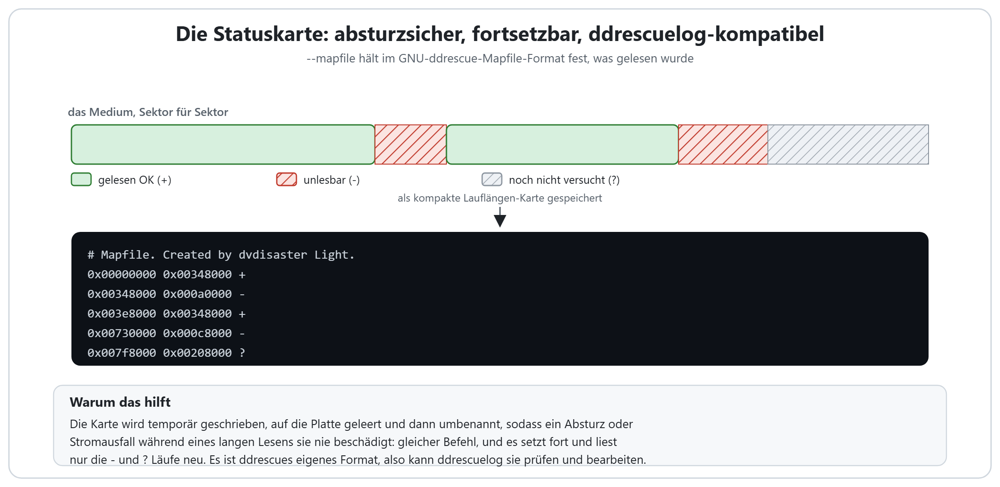

# So stellt dvdisaster Light eine beschädigte Disc wieder her

[English](HOW_IT_WORKS.md) | **Deutsch** | [日本語](HOW_IT_WORKS.ja.md) | [Italiano](HOW_IT_WORKS.it.md)

dvdisaster Light kann mehr, als Reed-Solomon-Fehlerkorrektur zu erzeugen und zu
nutzen: Sein Leser ist darauf ausgelegt, Daten von zerkratzten, alternden oder
sterbenden Discs zu holen. Diese Seite zeigt mit Bildern, wie jede
Wiederherstellungsfunktion arbeitet und warum ihr Einsatz sicher ist.

Alles hier ist **standardmäßig aus**. Ein einfaches Lesen (`-r`) verhält sich genau
wie bisher, und jede RS03-Datei, die dvdisaster Light schreibt, bleibt bit-für-bit
identisch mit dvdisaster 0.79.10-pl6. Die Wiederherstellungsoptionen ändern nur, was
der Leser *tut*; sie ändern nie die Daten, die in einen guten Sektor geschrieben
werden.

Die genauen Befehle und einen Schritt-für-Schritt-Ablauf finden Sie in
[RECOVERY.md](RECOVERY.md). Diese Seite erklärt das "Warum".

## Das Problem: ein Vorwärtslauf springt über einen Defekt hinaus

Trifft ein optisches Laufwerk auf einen Sektor, den es nicht lesen kann, hält es nicht
einfach an. Es meldet einen Fehler, und der Leser springt um einen Sprung nach vorn
(standardmäßig 16 Sektoren), um schnell an der beschädigten Stelle vorbeizukommen.
Dieser Sprung macht den ersten Durchlauf schnell, hat aber einen Preis: Das Laufwerk
gibt meist etwas zu früh auf und fängt etwas zu spät wieder an, sodass eine Handvoll
*lesbarer* Sektoren direkt nach dem Defekt mit übersprungen wird. Ein einzelner
Vorwärtslauf hinterlässt daher eine Lücke, die breiter ist als der eigentliche Schaden.

Jede Funktion unten schließt diese Lücke: die lesbaren Sektoren rund um einen Defekt
zurückholen, Unterbrechungen dabei überstehen und die wirklich toten Sektoren aus der
Parität wieder aufbauen, wenn Sie eine ecc-Datei haben.

## Rückwärtslesen (`-R`)

Ein Vorwärtslauf nähert sich einem Defekt von links und springt über dessen rechten
Rand hinaus. Ein **Rückwärtslauf** macht das Spiegelbild: Er liest die Disc vom letzten
zum ersten Sektor, nähert sich demselben Defekt also von rechts und springt stattdessen
über dessen *linken* Rand hinaus.

Kein Lauf für sich holt alles. Aber die Sektoren, die ein Vorwärtslauf verliert (direkt
nach dem Defekt), sind genau die, die ein Rückwärtslauf sauber liest, und umgekehrt.
Führt man beide aus, zusammengeführt in dasselbe Abbild, bleiben nur die Sektoren übrig,
die von beiden Seiten wirklich unlesbar sind: der echte Defekt. Manche Laufwerke spuren
oder fehlerkorrigieren in einer Richtung auch besser als in der anderen, sodass ein
Rückwärtslauf gelegentlich einen Sektor liest, den der Vorwärtslauf nie schaffte.

## Phasenweise Wiederherstellung (`--retry`)

Einen einzelnen Rückwärtslauf führt man selten von Hand aus. `--retry` automatisiert die
Idee: Nach dem ersten Durchlauf wechselt es fortlaufend einen Rückwärts- und einen
Vorwärtslauf über **nur die noch fehlenden Sektoren** und stoppt, wenn eine ganze Runde
nichts Neues mehr holt.

Ein breiter Schadensbereich ist selten über die ganze Breite tot. Von links gelesen
kommen die Sektoren bis zum ersten wirklich unlesbaren zurück; von rechts gelesen die ab
dessen Ende. Jeder Lauf trimmt etwas mehr von dem Rand ab, den das Laufwerk noch
erreicht, sodass der fehlende Bereich von beiden Seiten schrumpft, bis nur noch der harte
Kern (die Sektoren, die kein Laufwerk aus irgendeiner Richtung lesen kann) übrig bleibt.
Das macht aus dem alten "lies es, lies es nochmal, jetzt lies es andersherum" von Hand
eine einzige Option.

## Die absturzsichere Statuskarte (`--mapfile`)

Eine sterbende Disc wiederherzustellen kann Stunden dauern, und ein langes Lesen ist
genau der Moment, in dem ein Absturz, ein Hänger oder ein Stromausfall am
wahrscheinlichsten ist. `--mapfile` hält fest, was bereits gelesen wurde (welche Sektoren
gut sind, welche schlecht und welche noch nicht versucht wurden), sodass die Arbeit nie
verloren geht.

Die Karte wird im **GNU-ddrescue-Mapfile-Format** geschrieben: eine kompakte
Lauflängen-Liste von Byte-Bereichen, jeder markiert mit `+` (gelesen OK), `-` (unlesbar)
oder `?` (nicht versucht). Sie wird sicher gespeichert, in eine temporäre Datei
geschrieben, auf die Platte geleert und dann über die alte umbenannt, sodass selbst ein
Stromausfall mitten beim Schreiben sie nicht beschädigen kann. Denselben Befehl noch
einmal, und das Lesen setzt fort und liest nur die `-` und `?` Bereiche neu. Und weil es
ddrescues eigenes Format ist, kann ddrescues Werkzeug `ddrescuelog` diese Karten
unverändert prüfen und bearbeiten.

## Das Zeitlimit pro Lesevorgang (`--read-timeout`)

Auf einer sterbenden Disc kann ein Laufwerk *Minuten* damit verbringen, einen einzelnen
unlesbaren Sektor intern zu wiederholen, bevor es endlich einen Fehler meldet, und alles
dahinter in der Warteschlange wartet. Eine schlechte Stelle kann den ganzen Job
blockieren.

`--read-timeout n` setzt eine Obergrenze: Jeder Lesevorgang, der länger als `n` Sekunden
dauert, wird als Fehler behandelt, der Sektor wird markiert, und der Leser geht sofort
weiter. Zusammen mit `--retry` (oder `--rescue`) werden diese übersprungenen Sektoren
nicht aufgegeben; ein späterer Lauf kommt darauf zurück, wenn das Laufwerk sich neu
eingerastet, beruhigt hat oder einfach Glück hat. Das Zeitlimit gilt nur für das Lesen
ganzer Sektoren, nie für die kleinen Steuerbefehle, sodass es die Kommunikation mit dem
Laufwerk nicht stören kann.

## Vollständige automatische Wiederherstellung (`--rescue`)

`--rescue` fügt alles zu einem Befehl zusammen, für den Fall, dass Sie eine ecc-Datei
haben, die erstellt wurde, als die Disc noch gesund war. Es läuft in einer Schleife:

1. **Lesen**, was das Laufwerk kann, mit beidseitigem `--retry`.
2. **Auffüllen** aus ecc: Die RS03-Parität rekonstruiert Sektoren, die das Laufwerk gar
   nicht lesen konnte, solange der verbleibende Schaden innerhalb der hinzugefügten
   Redundanz liegt.
3. **Erneut lesen**, aber nur die Sektoren, die die Parität nicht beheben konnte, falls
   das Laufwerk diesmal Glück hat.

Es wiederholt sich, bis das Abbild vollständig ist, bis eine ganze Runde nichts bringt
oder bis eine Sicherheitsgrenze an Runden erreicht ist. Jede Runde versucht nur erneut,
was noch fehlt, liest also nie Sektoren neu, die es schon hat. Das Lesen holt, was von
der physischen Disc noch geht; die Parität baut wieder auf, was die Disc endgültig
verloren hat. Zusammen kann eine Disc, die nicht mehr sauber liest, trotzdem ein
perfektes Abbild ergeben, alles in einem Befehl.

Ohne ecc-Datei macht `--rescue` einfach den Lese-und-Wiederhol-Teil und meldet, was übrig
bleibt.

## Alles zusammen

Eine typische Wiederherstellung eskaliert nur so weit, wie die Disc es braucht:

1. Ein schneller erster Durchlauf mit einer `--mapfile`, um die einfachen Sektoren zu
   bekommen und festzuhalten, was fehlt.
2. `--retry`, um die Defekte von beiden Rändern zu trimmen.
3. `--read-timeout`, falls das Laufwerk an schlechten Stellen hängt.
4. `--rescue` (oder ein manuelles Auffüllen), falls Sie eine ecc-Datei haben, um wieder
   aufzubauen, was physisch verloren ist.
5. Ein anderes Laufwerk auf demselben Abbild und derselben Karte, denn ein Kratzer, den
   ein Laufwerk nicht lesen kann, liest sich in einem anderen oft einwandfrei.

Die vollständigen Befehlszeilen stehen in [RECOVERY.md](RECOVERY.md).

## Dank

Das Format der Statuskarte und der phasenweise Ansatz der Wiederherstellung in beide
Richtungen stammen von [**GNU ddrescue**](https://www.gnu.org/software/ddrescue/) von
Antonio Diaz Diaz. `--mapfile` schreibt ddrescues Mapfile-Format, sodass dessen Werkzeug
`ddrescuelog` unverändert mit diesen Karten arbeitet. In dvdisaster Light ist kein
ddrescue-Code enthalten; die Algorithmen sind eigenständig neu implementiert.
