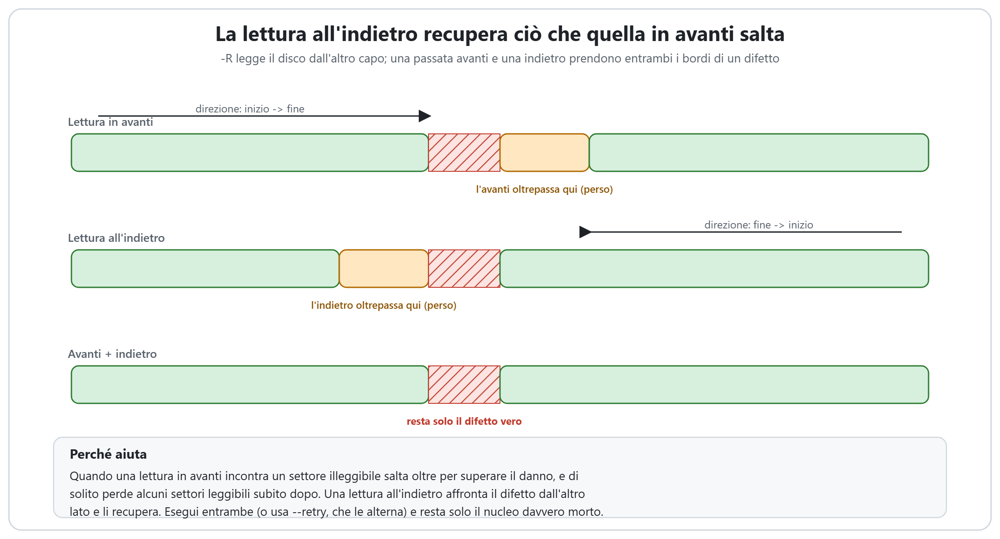
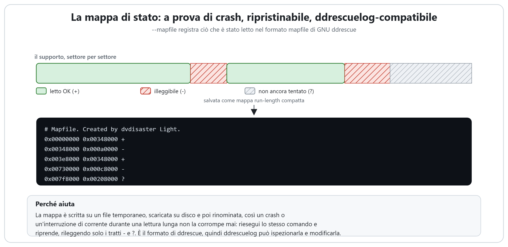
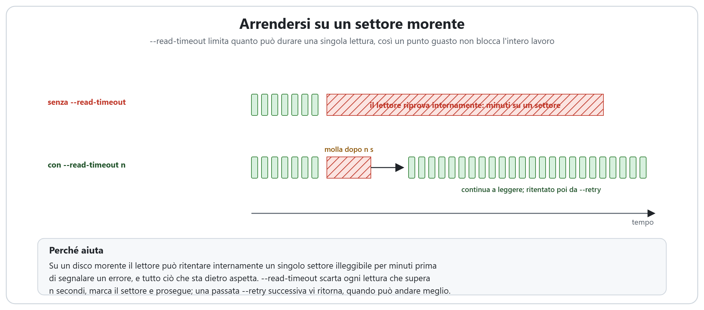
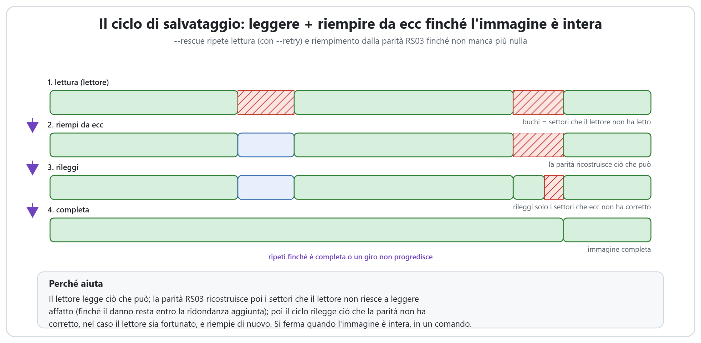

# Come dvdisaster Light recupera un disco danneggiato

[English](HOW_IT_WORKS.md) | [Deutsch](HOW_IT_WORKS.de.md) | [日本語](HOW_IT_WORKS.ja.md) | **Italiano**

dvdisaster Light sa fare più che aggiungere e usare la correzione d'errore
Reed-Solomon: il suo lettore è costruito per estrarre dati da dischi graffiati,
invecchiati o morenti. Questa pagina mostra, con le immagini, come funziona ogni
funzione di recupero e perché è sicuro usarla.

Tutto ciò che è mostrato qui è **disattivato in modo predefinito**. Una lettura semplice
(`-r`) si comporta esattamente come prima, e ogni file RS03 che dvdisaster Light scrive
resta identico bit per bit a dvdisaster 0.79.10-pl6. Le opzioni di recupero cambiano solo
ciò che il lettore *fa*; non cambiano mai i dati scritti in un settore buono.

Per i comandi esatti e un flusso di lavoro passo passo, vedere [RECOVERY.md](RECOVERY.md).
Questa pagina riguarda il "perché".

## Il problema: una lettura in avanti oltrepassa un difetto

Quando un lettore ottico incontra un settore che non riesce a leggere, non si ferma di
colpo. Segnala un errore, e il lettore salta in avanti di un balzo (16 settori in modo
predefinito) per superare in fretta l'area danneggiata. Quel salto è ciò che rende veloce
la prima passata, ma ha un costo: di solito il lettore molla un po' troppo presto e
riprende un po' troppo tardi, così una manciata di settori *leggibili* subito dopo il
difetto vengono saltati insieme a quelli illeggibili. Una singola passata in avanti lascia
quindi un vuoto più largo del danno reale.

Ogni funzione qui sotto esiste per chiudere quel vuoto: recuperare i settori leggibili
attorno a un difetto, sopravvivere alle interruzioni nel frattempo e ricostruire dalla
parità i settori davvero morti, quando si dispone di un file ecc.

## Lettura all'indietro (`-R`)

Una lettura in avanti affronta un difetto da sinistra e ne oltrepassa il bordo destro. Una
**lettura all'indietro** fa l'immagine speculare: legge il disco dall'ultimo settore al
primo, quindi affronta lo stesso difetto da destra e ne oltrepassa invece il bordo
*sinistro*.

Nessuna delle due passate da sola prende tutto. Ma i settori che una passata in avanti
perde (subito dopo il difetto) sono esattamente quelli che una passata all'indietro legge
senza problemi, e viceversa. Eseguendole entrambe, unite nella stessa immagine, gli unici
settori ancora mancanti sono quelli davvero illeggibili da entrambi i lati: il difetto
vero. Alcuni lettori inoltre tracciano o correggono gli errori meglio in una direzione che
nell'altra, così una passata all'indietro legge di tanto in tanto un settore che quella in
avanti non è mai riuscita a leggere.

## Recupero a fasi (`--retry`)

Raramente si esegue a mano una singola passata all'indietro. `--retry` automatizza l'idea:
dopo la prima passata continua ad alternare una passata all'indietro e una in avanti su
**solo i settori ancora mancanti**, e si ferma quando un intero giro non recupera più nulla
di nuovo.

Un'area danneggiata larga è raramente morta per tutta la sua estensione. Letta da sinistra
recupera i settori fino al primo davvero illeggibile; letta da destra recupera a partire
dalla sua coda. Ogni passata rifila un po' di più dal bordo che il lettore riesce ancora a
raggiungere, così la regione mancante si restringe da entrambi i lati finché resta solo il
nucleo duro (i settori che nessun lettore riesce a leggere da alcuna direzione). Questo
trasforma il vecchio "leggilo, leggilo di nuovo, ora leggilo al contrario" fatto a mano in
un'unica opzione.

## La mappa di stato a prova di crash (`--mapfile`)

Recuperare un disco che sta cedendo può richiedere ore, e una lettura lunga è proprio il
momento in cui un crash, un blocco o un'interruzione di corrente sono più probabili.
`--mapfile` registra ciò che è già stato letto (quali settori sono buoni, quali cattivi e
quali non ancora tentati) così il lavoro non va mai perso.

La mappa è scritta nel **formato mapfile di GNU ddrescue**: un elenco run-length compatto di
intervalli di byte, ciascuno contrassegnato con `+` (letto OK), `-` (illeggibile) o `?`
(non tentato). È salvata in modo sicuro, scritta su un file temporaneo, scaricata su disco e
poi rinominata sopra la vecchia, così nemmeno un'interruzione di corrente a metà scrittura
può corromperla. Riesegui lo stesso comando e la lettura riprende, rileggendo solo gli
intervalli `-` e `?`. E poiché è il formato di ddrescue, il suo strumento `ddrescuelog` può
ispezionare e modificare queste mappe senza modifiche.

## Il limite di tempo per lettura (`--read-timeout`)

Su un disco morente un lettore può passare *minuti* a ritentare internamente un singolo
settore illeggibile prima di segnalare finalmente un errore, e tutto ciò che sta dietro in
coda aspetta. Un solo punto guasto può bloccare l'intero lavoro.

`--read-timeout n` vi pone un tetto: ogni lettura che dura più di `n` secondi è trattata come
un fallimento, il settore viene marcato e il lettore prosegue dritto. In coppia con
`--retry` (o `--rescue`), quei settori saltati non vengono abbandonati; una passata
successiva vi ritorna, quando il lettore può essersi riassestato, calmato o semplicemente
essere fortunato. Il limite di tempo si applica solo alle letture di settori in blocco, mai
ai piccoli comandi di controllo, così non può interferire con il dialogo con il lettore.

## Recupero automatico completo (`--rescue`)

`--rescue` lega tutto in un solo comando, per quando si dispone di un file ecc creato mentre
il disco era ancora sano. Esegue un ciclo:

1. **Legge** ciò che il lettore riesce, usando `--retry` in entrambe le direzioni.
2. **Riempie** da ecc: la parità RS03 ricostruisce i settori che il lettore non è riuscito a
   leggere affatto, finché il danno rimanente resta entro la ridondanza aggiunta.
3. **Rilegge**, ma solo i settori che la parità non ha corretto, nel caso il lettore sia
   fortunato stavolta.

Si ripete finché l'immagine è completa, o finché un intero giro non fa progressi, o fino a un
limite di sicurezza di giri. Ogni giro ritenta solo ciò che manca ancora, quindi non rilegge
mai settori che ha già. La lettura recupera ciò che può dal disco fisico; la parità
ricostruisce ciò che il disco ha perso per sempre. Insieme, un disco che non legge più in
modo pulito può comunque produrre un'immagine perfetta, tutto in un solo comando.

Senza un file ecc, `--rescue` fa semplicemente la parte di lettura e ritentativo e segnala
ciò che resta.

## Mettere tutto insieme

Un recupero tipico sale di livello solo quanto il disco richiede:

1. Una prima passata veloce con una `--mapfile`, per prendere i settori facili e registrare
   ciò che manca.
2. `--retry` per assottigliare i difetti da entrambi i bordi.
3. `--read-timeout` se il lettore si blocca sulle aree difettose.
4. `--rescue` (o un riempimento manuale) se si dispone di un file ecc, per ricostruire ciò
   che è fisicamente perduto.
5. Un altro lettore sulla stessa immagine e mappa, perché un graffio che un lettore non
   riesce a leggere spesso si legge bene in un altro.

Le righe di comando complete sono in [RECOVERY.md](RECOVERY.md).

## Riconoscimenti

Il formato della mappa di stato e l'approccio di recupero a fasi in entrambe le direzioni
provengono da [**GNU ddrescue**](https://www.gnu.org/software/ddrescue/) di Antonio Diaz
Diaz. `--mapfile` scrive il formato mapfile di ddrescue, così il suo strumento `ddrescuelog`
funziona su queste mappe senza modifiche. In dvdisaster Light non è incluso alcun codice di
ddrescue; gli algoritmi sono reimplementati in modo indipendente.
