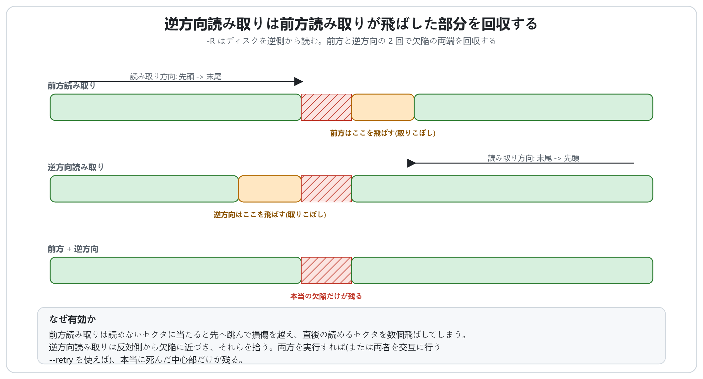
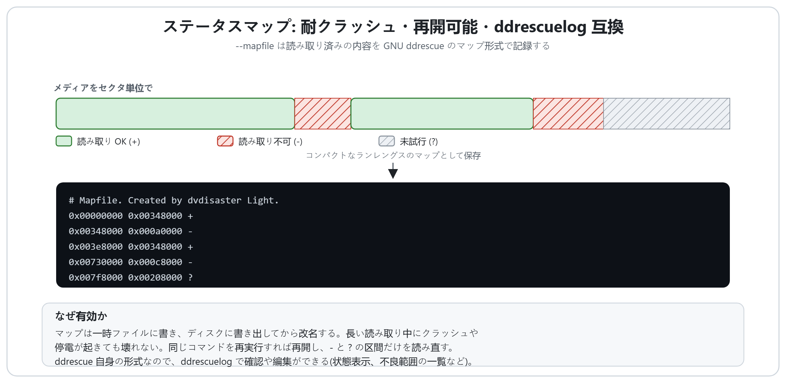
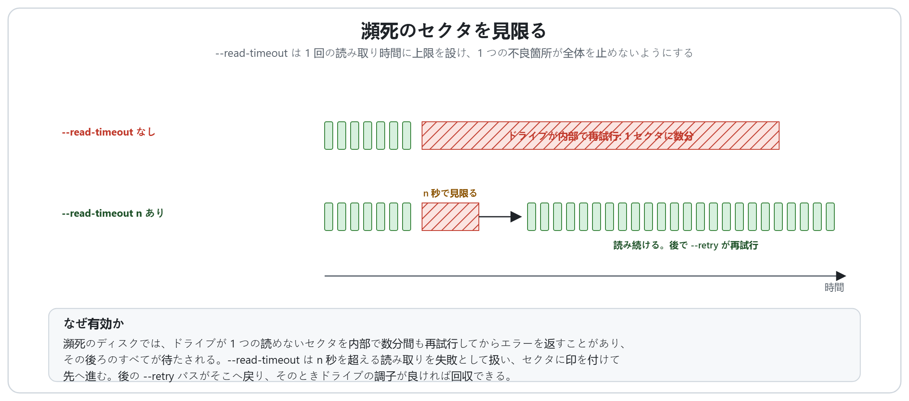
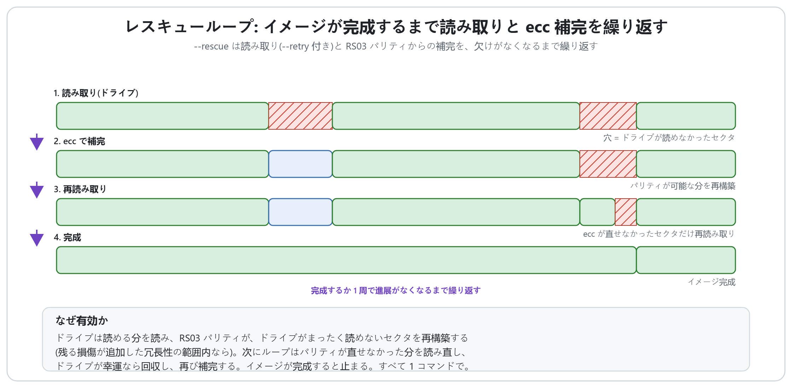

# dvdisaster Light による破損ディスクの回復方法

[English](HOW_IT_WORKS.md) | [Deutsch](HOW_IT_WORKS.de.md) | **日本語** | [Italiano](HOW_IT_WORKS.it.md)

dvdisaster Light は、リード・ソロモン方式のエラー訂正を作成・利用するだけのツールでは
ありません。そのリーダーは、傷んだ・劣化した・瀕死の光学メディアからデータを吸い出す
ために作られています。このページでは、各回復機能がどう動き、なぜ安全に使えるのかを図で
示します。

ここで説明するものはすべて**既定でオフ**です。通常の読み取り(`-r`)は従来どおりに動き、
dvdisaster Light が書き出す RS03 ファイルは dvdisaster 0.79.10-pl6 とビット単位で同一の
ままです。回復オプションはリーダーの*動作*だけを変え、正常なセクタに書き込むデータは
決して変えません。

正確なコマンドと手順は [RECOVERY.md](RECOVERY.md) を参照してください。このページは
「なぜそうするのか」を扱います。

## 問題: 前方読み取りは欠陥を飛び越える

光学ドライブは読めないセクタに当たっても、そこで止まりはしません。エラーを報告し、
リーダーは損傷部をすばやく通り過ぎるために一定量(既定で 16 セクタ)先へ跳びます。
この跳躍が最初のパスを速くしますが、代償があります。ドライブはたいてい少し早めに
あきらめ、少し遅れて再開するため、欠陥の直後にある*読める*セクタが数個、一緒に飛ばされて
しまいます。したがって 1 回の前方パスは、実際の損傷より広い空白を残します。

以下の各機能は、その空白を埋めるためにあります。欠陥の周りの読めるセクタを取り戻し、
その途中の中断を乗り越え、ecc ファイルがあれば本当に死んだセクタをパリティから作り
直します。

## 逆方向読み取り(`-R`)

前方読み取りは欠陥に左から近づき、その右端を飛び越えます。**逆方向読み取り**はその鏡像
です。ディスクを最後のセクタから先頭へ読むので、同じ欠陥に右から近づき、代わりにその
*左*端を飛び越えます。

どちらのパスも単独ではすべてを取れません。しかし前方パスが失うセクタ(欠陥の直後)は、
まさに逆方向パスがきれいに読めるセクタであり、その逆も成り立ちます。両方を実行して
同じイメージにまとめると、残るのは両側から本当に読めないセクタ、つまり真の欠陥だけです。
ドライブによっては一方の向きのほうがトラッキングやエラー訂正が得意なこともあり、逆方向
パスが前方パスでは決して読めなかったセクタを読むこともあります。

## フェーズ回復(`--retry`)

逆方向パスを 1 回だけ手で実行することはめったにありません。`--retry` はその考え方を
自動化します。最初のパスの後、**まだ欠けているセクタだけ**に対して逆方向パスと前方パスを
交互に続け、1 周して何も新たに取れなくなったら止まります。

広い損傷部でも、全幅にわたって死んでいることはまれです。左から読めば最初の本当に読めない
セクタまで回収でき、右から読めばその末尾から回収できます。各パスはドライブがまだ届く側の
端を少しずつ削るので、欠けている領域は両側から縮み、最後にはどの向きからもどのドライブも
読めない硬い芯だけが残ります。これにより、昔ながらの「読んで、もう一度読んで、今度は逆
から読む」という手作業が 1 つのオプションになります。

## 耐クラッシュのステータスマップ(`--mapfile`)

瀕死のディスクの回復には何時間もかかることがあり、長い読み取り中こそクラッシュ・
ハングアップ・停電が最も起きやすい瞬間です。`--mapfile` は、すでに読み取った内容(どの
セクタが良好で、どれが不良で、どれがまだ未試行か)を記録するので、作業が失われることは
ありません。

マップは **GNU ddrescue のマップ形式**で書かれます。バイト範囲のコンパクトなランレングス
列で、各範囲に `+`(読み取り OK)・`-`(読み取り不可)・`?`(未試行)のいずれかが付きます。
保存は安全に行われ、一時ファイルに書き、ディスクへ書き出し、それから古いものへ改名する
ので、書き込みの途中で停電が起きてもマップが壊れることはありません。同じコマンドを再実行
すれば読み取りが再開し、`-` と `?` の範囲だけを読み直します。そして ddrescue 自身の形式
なので、ddrescue のツール `ddrescuelog` がこれらのマップをそのまま確認・編集できます。

## 読み取りごとのタイムアウト(`--read-timeout`)

瀕死のディスクでは、ドライブが 1 つの読めないセクタを内部で*数分間*も再試行してから、
ようやくエラーを報告することがあり、その後ろのキューにあるすべてが待たされます。1 つの
不良箇所がジョブ全体を止めてしまうのです。

`--read-timeout n` はそれに上限を設けます。`n` 秒を超える読み取りは失敗として扱い、その
セクタに印を付け、リーダーはすぐ次へ進みます。`--retry`(または `--rescue`)と組み合わせ
れば、飛ばされたセクタは見捨てられません。後のパスがそこへ戻り、そのときドライブが再び
噛み合ったり、落ち着いたり、単に運が良かったりすれば読めます。タイムアウトはセクタの一括
読み取りにのみ適用され、小さな制御コマンドには決して適用されないので、ドライブとのやり
取りを妨げることはありません。

## 完全自動回復(`--rescue`)

`--rescue` はすべてを 1 つのコマンドにまとめます。ディスクがまだ健康なうちに作った ecc
ファイルがある場合のためのものです。次のループを回します。

1. 両方向の `--retry` を使って、ドライブが読める分を**読む**。
2. ecc から**補完する**。RS03 パリティが、ドライブがまったく読めなかったセクタを、残る
   損傷が追加した冗長性の範囲内であれば再構築します。
3. **再び読む**。ただしパリティが直せなかったセクタだけを、今度はドライブの運が良い場合に
   備えて読みます。

これを、イメージが完成するまで、あるいは 1 周して進展がなくなるまで、あるいは安全のための
回数上限に達するまで繰り返します。各周はまだ欠けている分だけを再試行するので、すでに持って
いるセクタを読み直すことはありません。読み取りは物理ディスクから取れる分を回収し、パリティ
はディスクが完全に失った分を作り直します。両者が組み合わさることで、もはやきれいに読めない
ディスクからでも、完璧なイメージを、すべて 1 つのコマンドで得られることがあります。

ecc ファイルがなければ、`--rescue` は読み取りと再試行の部分だけを行い、残りを報告します。

## まとめて使う

典型的な回復は、ディスクが必要とする分だけ段階的に強めていきます。

1. `--mapfile` を付けた高速な最初のパスで、簡単なセクタを取り、何が欠けているかを記録
   する。
2. `--retry` で欠陥を両端から削る。
3. ドライブが不良箇所で止まるなら `--read-timeout`。
4. ecc ファイルがあれば `--rescue`(または手動の補完)で、物理的に失われた分を作り直す。
5. 同じイメージとマップに別のドライブを。あるドライブで読めない傷が、別のドライブでは
   まったく問題なく読めることはよくあります。

完全なコマンドラインは [RECOVERY.md](RECOVERY.md) にあります。

## 謝辞

ステータスマップの形式と、両方向のフェーズ回復の手法は、Antonio Diaz Diaz 氏による
[**GNU ddrescue**](https://www.gnu.org/software/ddrescue/) に由来します。`--mapfile` は
ddrescue のマップ形式で書き出すため、そのツール `ddrescuelog` がこれらのマップをそのまま
扱えます。dvdisaster Light には ddrescue のコードは含まれておらず、アルゴリズムは独自に
再実装しています。
