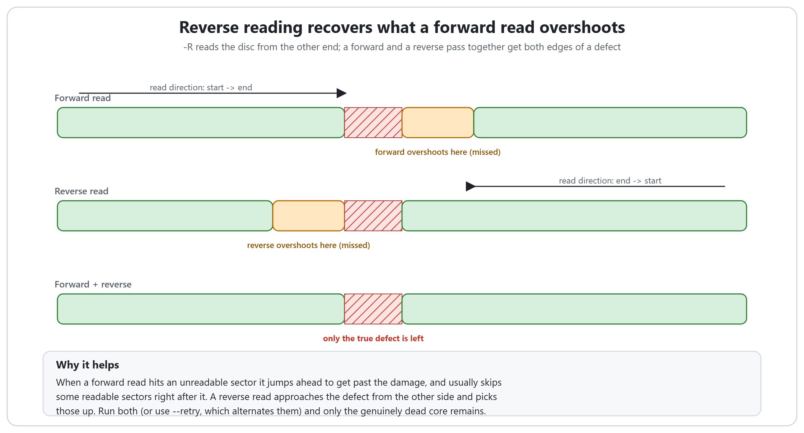
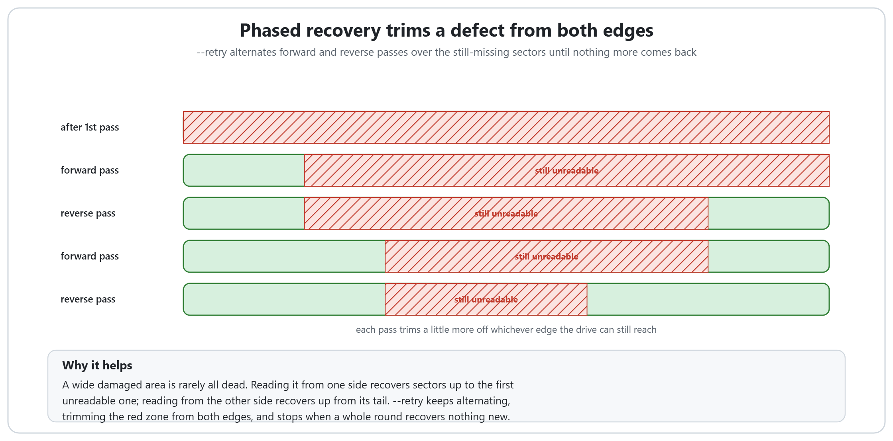
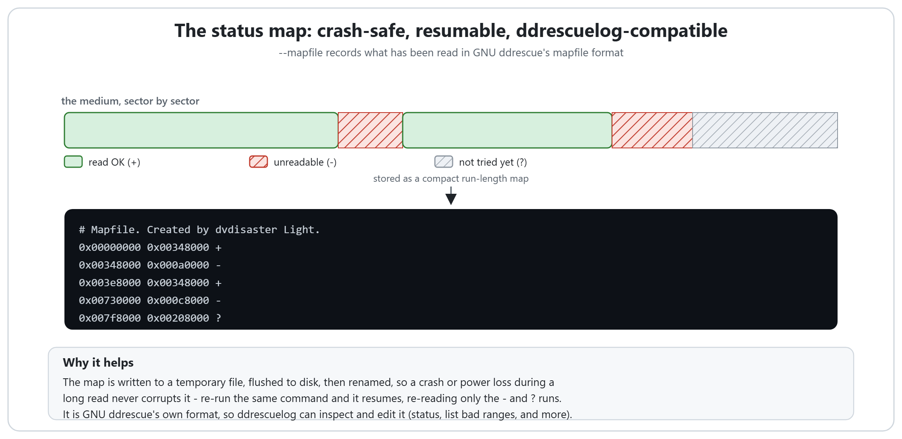
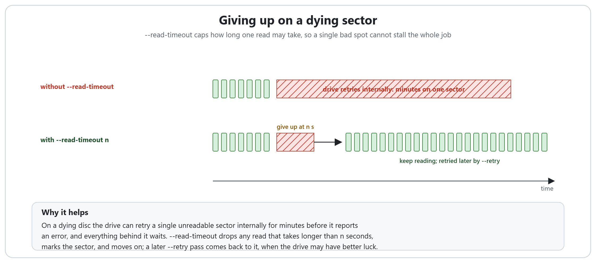
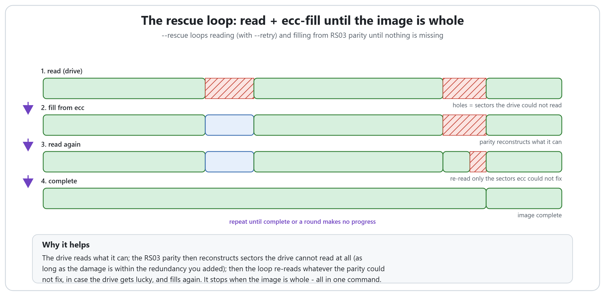

# How dvdisaster Light recovers a damaged disc

**English** | [Deutsch](HOW_IT_WORKS.de.md) | [日本語](HOW_IT_WORKS.ja.md) | [Italiano](HOW_IT_WORKS.it.md)

dvdisaster Light can do more than add and use Reed-Solomon error correction: its
reader is built to pull data off scratched, aging or dying discs. This page shows,
with pictures, how each recovery feature works and why it is safe to use.

Everything shown here is **off by default**. A plain read (`-r`) behaves exactly as
it always did, and every RS03 file dvdisaster Light writes stays bit-for-bit
identical to dvdisaster 0.79.10-pl6. The recovery options only change what the
reader *does*; they never change the data written to a good sector.

For the exact commands and a step-by-step workflow, see [RECOVERY.md](RECOVERY.md).
This page is about the "why".

## The problem: a forward read overshoots a defect

When an optical drive hits a sector it cannot read, it does not stop dead. It
reports an error, and the reader skips ahead by a jump (16 sectors by default) to
get past the damaged area quickly. That skip is what makes a first pass fast, but it
has a cost: the drive usually gives up a little early and recovers a little late, so
a handful of *readable* sectors right after the defect get skipped along with the
unreadable ones. A single forward pass therefore leaves a gap that is wider than the
real damage.

Every feature below exists to close that gap: to recover the readable sectors around
a defect, to survive interruptions while doing it, and to rebuild the genuinely dead
sectors from parity when you have an ecc file.

## Reverse reading (`-R`)

A forward read approaches a defect from the left and overshoots its right edge. A
**reverse read** does the mirror image: it reads the disc from the last sector to the
first, so it approaches the same defect from the right and overshoots its *left* edge
instead.

Neither pass on its own gets everything. But the sectors a forward pass loses (just
after the defect) are exactly the ones a reverse pass reads cleanly, and the other
way around. Run both, combined into the same image, and the only sectors still
missing are the ones that are genuinely unreadable from either side: the true defect.
Some drives also track or error-correct better in one direction than the other, so a
reverse pass occasionally reads a sector the forward pass never could.

## Phased recovery (`--retry`)

You rarely run a single reverse pass by hand. `--retry` automates the idea: after the
first pass it keeps alternating a reverse pass and a forward pass over **only the
sectors that are still missing**, and stops when a whole round recovers nothing new.

A wide damaged area is rarely dead all the way across. Reading it from the left
recovers sectors up to the first truly unreadable one; reading from the right recovers
up from its tail. Each pass trims a little more off whichever edge the drive can still
reach, so the missing region shrinks from both sides until only the hard core (the
sectors no drive can read from any direction) is left. This turns the old "read it,
read it again, now read it the other way" by hand into a single option.

## The crash-safe status map (`--mapfile`)

Recovering a failing disc can take hours, and a long read is exactly when a crash, a
hang or a power cut is most likely. `--mapfile` records what has already been read
(which sectors are good, which are bad, and which have not been tried yet) so the work
is never lost.

The map is written in **GNU ddrescue's mapfile format**: a compact run-length list of
byte ranges, each tagged `+` (read OK), `-` (unreadable) or `?` (not tried). It is
saved safely, written to a temporary file, flushed to disk, then renamed over the old
one, so even a power loss in the middle of writing it cannot corrupt it. Re-run the
same command and the read resumes, re-reading only the `-` and `?` ranges. And because
it is ddrescue's own format, ddrescue's `ddrescuelog` tool can inspect and edit these
maps unchanged.

## The per-read timeout (`--read-timeout`)

On a dying disc a drive can spend *minutes* retrying a single unreadable sector
internally before it finally reports an error, and everything behind it in the queue
waits. One bad spot can stall the whole job.

`--read-timeout n` puts a ceiling on it: any read that takes longer than `n` seconds is
treated as a failure, the sector is marked, and the reader moves straight on. Paired
with `--retry` (or `--rescue`), those skipped sectors are not abandoned; a later pass
comes back to them, when the drive may have re-seated, settled, or simply gets lucky.
The timeout applies only to bulk sector reads, never to the small control commands, so
it cannot interfere with talking to the drive.

## Full automatic recovery (`--rescue`)

`--rescue` ties everything together into one command, for when you have an ecc file
made while the disc was still healthy. It loops:

1. **Read** what the drive can, using both-direction `--retry`.
2. **Fill** from ecc: the RS03 parity reconstructs sectors the drive could not read at
   all, as long as the remaining damage is within the redundancy you added.
3. **Read again**, but only the sectors the parity could not fix, in case the drive
   gets lucky this time.

It repeats until the image is complete, or a whole round makes no progress, or a safety
limit of rounds is reached. Each round only re-attempts what is still missing, so it
never re-reads sectors it already has. The read recovers what it can from the physical
disc; the parity rebuilds what the disc has lost for good. Between them, a disc that no
longer reads cleanly can still yield a perfect image, all in one command.

Without an ecc file, `--rescue` simply does the read-and-retry part and reports what
remains.

## Putting it together

A typical recovery escalates only as far as the disc needs:

1. A fast first pass with a `--mapfile`, to get the easy sectors and record what is
   missing.
2. `--retry` to trim the defects from both edges.
3. `--read-timeout` if the drive stalls on bad areas.
4. `--rescue` (or a manual fill) if you have an ecc file, to reconstruct what is
   physically gone.
5. Another drive on the same image and map, because a scratch one drive cannot read
   often reads fine in another.

The full command lines are in [RECOVERY.md](RECOVERY.md).

## Credits

The status map format and the phased both-direction recovery approach come from
[**GNU ddrescue**](https://www.gnu.org/software/ddrescue/) by Antonio Diaz Diaz.
`--mapfile` writes ddrescue's mapfile format, so its `ddrescuelog` tool works on these
maps unchanged. No ddrescue code is included in dvdisaster Light; the algorithms are
reimplemented independently.
